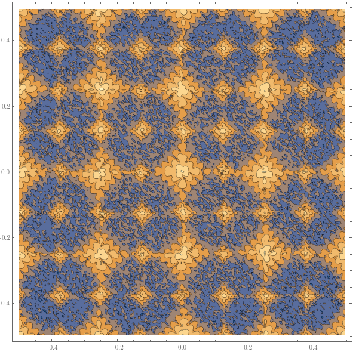

# FMM
C++ / Mathematica implementation of the FMM for the evaluation of potentials and force fields in gravitation/electrostatics problems, parallelized via OpenMP

#### Sample (integrated via Mathematica's symplectic partitioned Runge Kutta integrator): 

#### A plot of error distributions included for no other reason than it's aesthetic value

#### Overview of the content of various source files: 

##### Tree Classes
| file| description | 
| -----------------------------  | ----------------------------- | 
| abstract_orthtree.hpp | Abstract base class for quad/octrees 
| adaptive_orthtree.hpp | Abstract base class for adaptive quad/octrees
| balanced_orthtree.hpp | Abstract base class for balanced quad/octrees
| abstract_fmm_tree.hpp | Abstract base class for the FMM tree data structure 
| adaptive_fmm_tree.hpp | Implementation of the adaptive FMM
| balanced_fmm_tree.hpp | Implementation of the balanced FMM

##### Local and Multipole Expansions
| file| description | 
| -----------------------------  | ----------------------------- | 
| series_expansion.hpp | Abstract base class for series expansions 
| multipole_expansion.hpp | Implementation of the multipole expansion
| local_expansion.hpp | Implementation of the local expansion
| vector.hpp | Vector and pointsource classes used in the FMM
| fields.hpp | Potential and force field functions, direct algorithm 
| | 
| fmm_tables.hpp | Classes that function as lookup tables 
| fmm_general.hpp | Frequently used utility functions 
| debugging.hpp | Code that aided in debugging and IO operations 

##### Mathematica Integration, Examples, Testing & Debugging
| folder | description | 
| -----------------------------  | ----------------------------- | 
| examples | Folder containing some minimal examples
| test | Code used for verification and testing
| misc | Miscelleanous items
| mathematica | Code for the Mathematica interface
| logs | Target directory for logs
